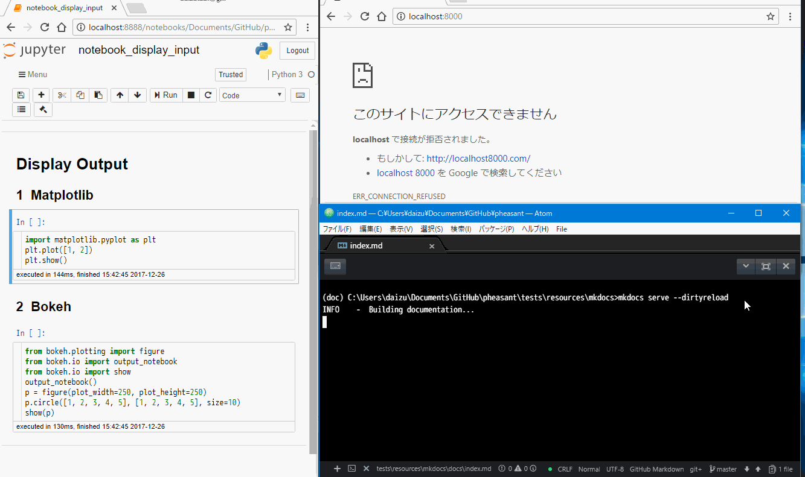

# Pheasant

[![PyPI version][pypi-image]][pypi-link]
[![Anaconda Version][anaconda-v-image]][anaconda-v-link]
[![Travis][travis-image]][travis-link]
[![Coverage Status][coveralls-image]][coveralls-link]

[pypi-image]: https://badge.fury.io/py/pheasant.svg
[pypi-link]: https://pypi.org/project/pheasant
[anaconda-v-image]: https://anaconda.org/daizutabi/pheasant/badges/version.svg
[anaconda-v-link]: https://anaconda.org/daizutabi/pheasant
[travis-image]: https://travis-ci.org/daizutabi/pheasant.svg?branch=master
[travis-link]: https://travis-ci.org/daizutabi/pheasant
[coveralls-image]: https://coveralls.io/repos/github/daizutabi/pheasant/badge.svg?branch=master
[coveralls-link]: https://coveralls.io/github/daizutabi/pheasant?branch=master

Documentation tool for Pelican and MkDocs.

## Demo

## Description

Pheasant is a Markdown converter which is designed to be used as a plugin for static site generators such as MkDocs or Pelican. The Pheasant main feature is auto generation of outputs for a fenced code block in Markdown source using Jupyter client. In addition, Pheasant can automatically number headers, figures, and tables.
